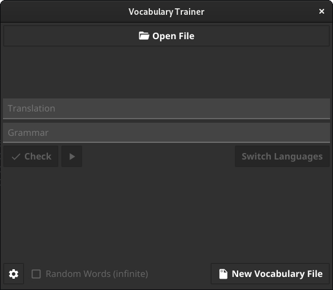

# Vocabulary Trainer

## About

Vocabulary Trainer is a small application written in Go, that can help you with learning new vocabulary.



## Installation

The VocabularyTrainer is currently available for Windows, macOS and Linux.

### Windows

- Download the .exe file from the [releases section](https://github.com/Palexer/vocabulary-trainer/releases) and execute it.

### Linux

- Download the .tar.gz package from the [releases section](https://github.com/Palexer/vocabulary-trainer/releases) and extract it.

- After that, open a terminal in the folder, that contains the "Makefile"

- Execute the following command:
  
  ```bash
  sudo make install
  ```

### macOS

- Download the .dmg file from the [releases section](https://github.com/Palexer/vocabulary-trainer/releases) and open it. You can now drag the application into your applications folder and execute it. 

## Usage

In order to use the Vocabulary Trainer you need a correctly formatted .json-file. You can see how to create one down below.
You then need to open the file with the Vocabulary Trainer and the program will show you the first foreign word.
Enter a translation and, if you need to, also additional grammar. You can also enter multiple translations by separating them with a comma.
The grammar has to be entered completely. If you entered your translation and grammar, click on the check button to see if you're input was correct. If this is not the case, you will now see the correct answer. 
Click on "Continue" to go to the next word. The Vocabulary Trainer will count your correct answers as well as your already finished words while you are practicing.

### Creating JSON files

In order to use the Vocabulary Trainer, you need to open a correctly formatted .json-file with it.
You can create one by using the Vocabulary Generator, a utility that is built into the Vocabulary Trainer.

_Note: The grammar input is optional, if you don't want to use just leave it blank._

### Keyboard Shortcuts

#### Vocabulary Trainer
|Keys|Action|
|---|------|
|Ctrl+Q|quit application|
|Ctrl+O|open file|
|Ctrl+G|open Vocabulary Generator|


#### Vocabulary Generator
|Keys|Action|
|---|------|
|Ctrl+S|save file|

## Help

If you have any problems with the program or the repository you can create an [issue](https://github.com/Palexer/vocabulary-trainer/issues) on the Github page.

### Available languages for TTS

Your usual abbreviations for the languages should mostly word. Here are some tested ones:

|Language|Abbreviations|
|--------|-------------|
|English|en|
|German|de|
|Latin|la|
|French|fr|
|Spanish|es|

## License

[GPL v3](LICENSE)
